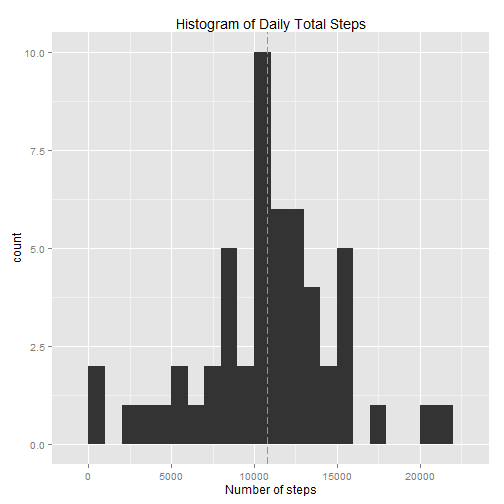
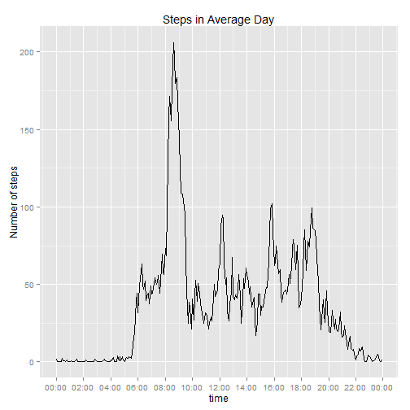
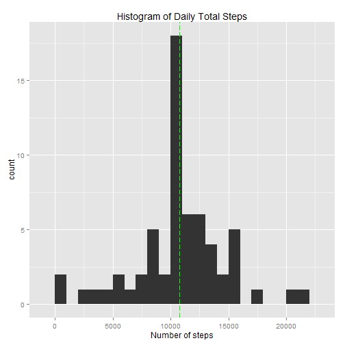
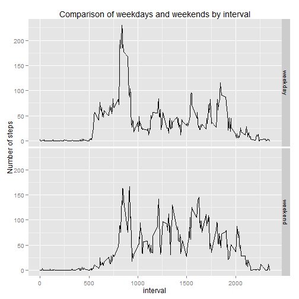
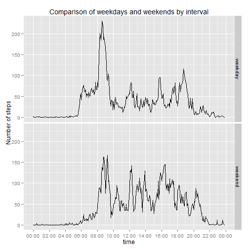

Pre-requisites.


```r
library(scales)
library(ggplot2)
```

## Loading and preprocessing the data

There is no need to process the date (string) or interval (integer)
columns in the data as yet.


```r
unzip("activity.zip")
activity <- read.table("activity.csv",
					   sep = ",", stringsAsFactors = FALSE, header = TRUE)
```

## What is mean total number of steps taken per day?


```r
daily <- aggregate(steps ~ date, data = activity, FUN = sum)
```

Discarding incomplete rows, the mean is 10766 
(green dashed line in plot),
and the median is 10765.


```r
qplot(steps, data = daily, geom = "histogram", binwidth = 1000) +
	ggtitle("Histogram of Daily Total Steps") +
	xlab("Number of steps") +
	geom_vline(xintercept = mean(daily$steps),
			   colour="green", linetype = "longdash")
```

 

## What is the average daily activity pattern?


```r
ave.day <- aggregate(steps ~ interval, data = activity, FUN = mean)
max.steps <- max(ave.day$steps)
# Interval with max.steps. (Happens that this is unique.)
msi <- ave.day$interval[which(ave.day$steps == max.steps)]
# String representation of time of day from interval.
i.to.t <- function(i) { paste(i %/% 100, i %% 100, sep = ":") }
```

The maximum number of steps in the average day was 206, 
contained in the single interval starting at 8:35.


```r
# Use an artificial date to construct a POSIXct for plotting.
ave.day$time <- as.POSIXct(paste0("2000-01-01 ", i.to.t(ave.day$interval)))
qplot(time, steps, data = ave.day, geom="line") +
	ggtitle("Steps in Average Day") +
	ylab("Number of steps") +
	scale_x_datetime(labels = date_format("%H:%M"), breaks = "2 hour")
```

 

## Imputing missing values


```r
num_c <- nrow(activity)
num_cc <- sum(complete.cases(activity))
num_ci <- num_c - num_cc
```

The number of rows with missing data is 2304.

Fill in missing steps values by rounding the steps value
for the corresponding interval in the average day.
The offset function turns an interval value into the correct index of ave.day.


```r
offset <- function(i) { 
	hours <- (i %/% 100) 
	minutes <- (i %% 100)
	# First entry is 0000. 12 readings per hour.
	return(12 * hours + minutes %/% 5 + 1)
}
missing <- which(is.na(activity$steps))
imp.act <- activity
imp.act$steps[missing] <- round(ave.day$steps[offset(imp.act$interval[missing])])
imp.daily <- aggregate(steps ~ date, data = imp.act, FUN = sum)
```

Working with imputed data, the mean is 10765,
and the median is 10762.
The difference from the same measures in the uncorrected data is small.
However, imputing values as above seems to reduce the variability in the data,
as seen in the following plot.


```r
qplot(steps, data = imp.daily, geom = "histogram", binwidth = 1000) +
	ggtitle("Histogram of Daily Total Steps") +
	xlab("Number of steps") +
	geom_vline(xintercept = mean(imp.daily$steps),
			   colour = "green", linetype = "longdash")
```

 

## Are there differences in activity patterns between weekdays and weekends?

Data preparation.


```r
weekend.days <- c("Sat", "Sun")
is.weekend <- function(aString) { 
	weekdays(as.Date(aString), TRUE) %in% weekend.days
}
imp.act$daytype <- factor(is.weekend(imp.act$date))
levels(imp.act$daytype)[levels(imp.act$daytype) == TRUE] <- "weekend"
levels(imp.act$daytype)[levels(imp.act$daytype) == FALSE] <- "weekday"
```

Use faceting in ggplot2 to compare weekdays and weekends. The following plot
uses interval value as a numerical x-axis. This seems unhelpful.
But I have included it because it seems to be what he asked for.

Here is a similar plot, translating interval to time, using the same technique
as above.


```r
aves.by.int.dt <- aggregate(steps ~ interval * daytype, imp.act, FUN="mean")
qplot(interval, steps, data = aves.by.int.dt,
	  facets = daytype ~ .,
	  geom = "line") +
	ylab("Number of steps") +
	ggtitle("Comparison of weekdays and weekends by interval") 
```

 


```r
aves.by.int.dt$time <-
	as.POSIXct(paste0("2000-01-01 ", i.to.t(aves.by.int.dt$interval)))
qplot(time, steps, data = aves.by.int.dt, 
	  facets = daytype ~ .,
	  geom = "line") +
	ggtitle("Comparison of weekdays and weekends by interval") +
	ylab("Number of steps") +
	scale_x_datetime(labels = date_format("%H:%M"), breaks = "2 hour")
```

 

